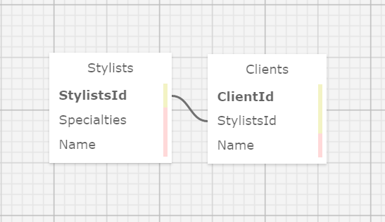

# _Eau Claire's Salon_

#### By _**Skylar Brockbank**_

#### _Salon Client and Stylist tracking application_

## Technologies Used

* _C#_
* _.Net 5.0_
* _MySQL_
* _Pomelo Entity Framework for MySql_
* _Microsoft Entity Framework_

## Description

_A hair salon application that uses one to many relationships to assign clients to Stylists with specific skill sets_

## Setup/Installation Requirements

* _Click the green "Code" button and Download Zip _
* _Extract the contents of the zip file to a folder on your machine_
* _Import the included .sql file_
* _Navigate to the HairSalon Directory and `touch appsettings.json` and fill with the following_
```
{
    "ConnectionStrings": {
        "DefaultConnection": "Server=localhost;Port=3306;database=PROJECT_NAME;uid=root;pwd=[YOUR-PASSWORD-HERE];"
    }
}
```
* _Replace `PROJECT_NAME` with the name of your database, and `[YOUR-PASSWORD-HERE]` with your MySql Password.

* _`dotnet run` to run_

* _[Here](https://www.learnhowtoprogram.com/c-and-net/database-basics-c2449db9-5bd8-4303-af8d-7ed7259f79a7/creating-a-test-database-exporting-and-importing-databases-with-mysql-workbench) is information on how to import databases with MySql Workbench_

* _alternatively you can [clone this repository](https://www.learnhowtoprogram.com/introduction-to-programming/git-html-and-css/practice-github-remote-repositories) from Git Hub_


## Known Bugs

* _TBD_

## License

*[MIT](https://opensource.org/licenses/MIT) Licenced
*Copyright (c) _2021_ _Skylar Brockbank_

## Database Diagram

